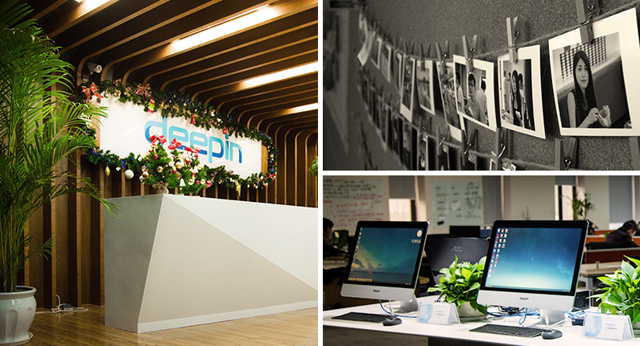
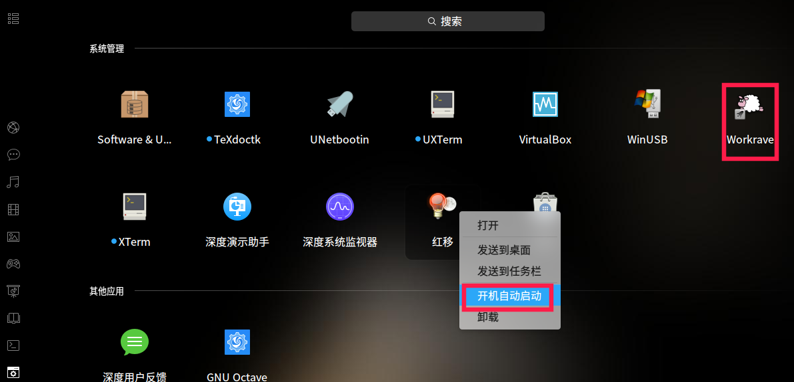
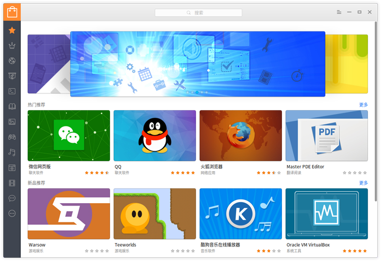
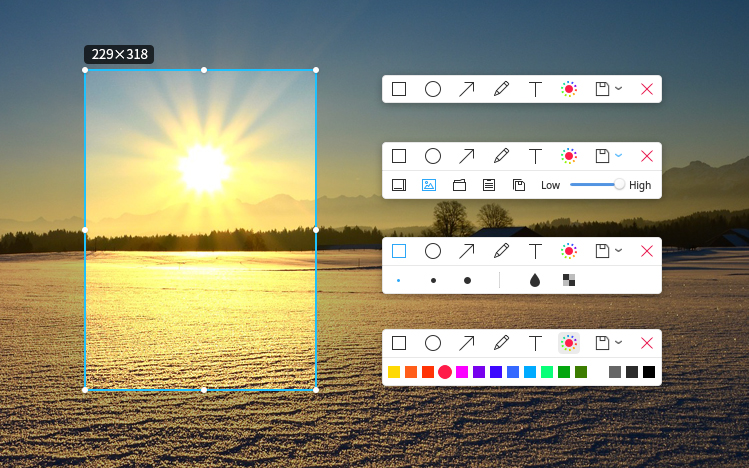
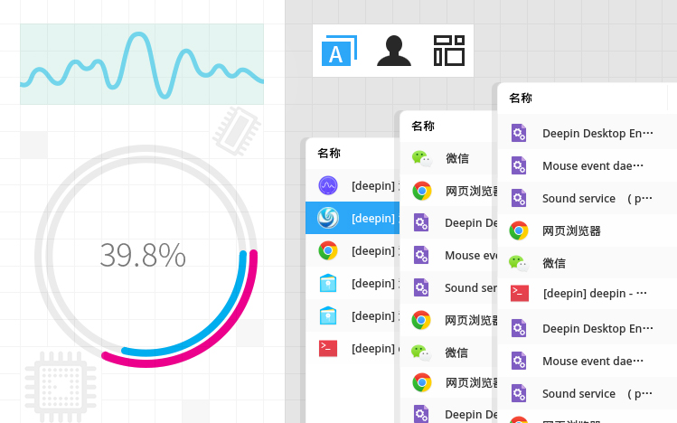

# 深度操作系统\index{深度操作系统}简介 {#deepin-intro}

摘自：[深度商业官网](https://www.deepin.com/)、[深度社区官网](https://www.deepin.org/)。已获[许可](https://bbs.deepin.org/forum.php?mod=viewthread&tid=39632&page=10#pid377474)。

## 深度科技简介\index{深度科技}

武汉深之度科技有限公司（简称：深度科技）成立于2011年，是专注基于Linux的国产操作系统研发与服务的商业公司。

作为国内顶尖的操作系统研发团队，深度科技以提供安全可靠、美观易用的国产操作系统与开源解决方案为目标，拥有操作系统研发、行业定制、国际化、迁移和适配、交互设计、支持服务与培训等多方面专业人才，能够满足不同用户和应用场景对操作系统产品的广泛需求。



深度科技作为国产操作系统生态的打造者，不但与各芯片、整机、中间件、数据库等厂商结成了紧密合作关系，还与360、金山、网易、搜狗等企业联合开发了多款符合中国用户需求的应用软件。深度科技的操作系统产品，已通过了公安部安全操作系统认证、工信部国产操作系统适配认证、入围国管局中央集中采购名录，并在国内党政军、金融、运营商、教育等客户中得到了广泛应用。

截止到2016年，深度操作系统下载超过5000万次，提供32种不同的语言版本，以及遍布六大洲28个国家84个镜像站点的升级服务。在全球开源操作系统排行榜上，深度操作系统已跃居前十名，也是排名最高的中国操作系统产品。
未来，深度科技将继续秉承开源和创新精神，以操作系统的自主可控替代为契机，争取在三年内成为中国市场主要操作系统供应商，五年后成为具备国际影响力的主流操作系统厂商。

注：深度论坛网友 [licardo](https://bbs.deepin.org/forum.php?mod=viewthread&tid=145309&page=1#pid378170) 建议，`国产操作系统` 改为 `国内发行版`。深以为然。但是考虑到转帖的别人的文章，就保留不变了，特此说明。

## 使用人群

### 程序员

作为一个写过代码的人，用深度 Linux 感觉自己的电脑就是自己的。可以尽情写代码，不受各种弹窗的干扰。四个桌面，开发网站时，左右逢源，一个放置待测试网页，一个放置 vim + 源代码，一个 vscode 做笔记，一个打开浏览器查询各种资料。

### 文员

我感觉对于办公的最基本的需求，搜狗输入法和 WPS 是提供了的。

### 游戏爱好者

深度自带 steam 游戏平台，好多游戏可以畅玩。快来玩玩吧。

## 深度桌面使用

（本节仿照《Linux Bible》第二章内容书写。）

### 开机

如果你使用过 Windows 操作系统，那么使用深度桌面操作系统也不是难事。这里主要讲社区版深度桌面操作系统。
开机登录后，点击 Windows 键会弹出如下界面。


你可以对所需要的软件进行搜索。直接点击软件图标，就可以打开软件了。分类放置的软件。在任务栏驻留的软件打开时，还会有动画显示。


**深度文件管理器**

双击桌面上的计算机图标，会弹出深度文件管理器，用于打开各类文件。


可以使用 Super + 左右箭头 或者 Super + S 切换桌面，Alt + tab, Super + W 切换窗口。

### 关机

同时按 Ctrl + Alt + Delete，或者点击右下角关机按钮，就会弹出关机界面，如下图所示。


### 控制中心-系统设置

点击任务栏，或者鼠标滑向桌面右下角几次，会在右侧出现控制中心面板。如下图所示。


首页展示快速入口、常用快捷设置等，让操作更加方便和快捷；天气详情、通知中心通过插件展示，今后会开放插件接口，让您可以更多的参与定制。

### 开机自启动

一些软件需要开机自启动，比如 QQ 还有一些保护眼睛的软件，比如定时休息的 workrave， 减少蓝光的 red-shift。点击 Super （Windows）键，弹出所有的软件图标，看中要开机自启动的，右击选择开机启动。



### 安装软件

使用电脑，不可避免的要用到很多软件。深度商店为您解忧愁，方便您查找并安装相关的软件。当然除了深度商店，您还可以使用命令行安装软件，关于命令行安装软件的介绍详见后面章节。



### 卸载软件

按 windows 键，弹出的软件，右击选择卸载。或者命令行，这里就不介绍了，在后面详细说明。

## 深度桌面常用的几款软件

下面这些软件，非常适合普通人使用了。特摘抄下来。

### 搜狗输入法

这个是系统默认自带的了，贴它是为了怀念曾经被输入法折磨的岁月。官网有详细介绍：http://pinyin.sogou.com/linux/?r=pinyin

不过我最希望有讯飞语音输入法，这个如果可以在 Linux 桌面下生存，是最好不过的。不过当前还没有 Linux 版本。

### QQ

国人挚爱。可以视频。就不废话了。命令行安装。

```bash
$\$$ sudo apt-get update
$\$$ sudo apt-get install deepin.com.qq.im
```

### 深度截图


深度截图是深度科技团队开发的一款精巧截图应用，它具有智能窗口识别、快捷键支持、图片编辑、延迟截图、智能保存、调节图像分辨率等功能。
深度截图V4.0作为系统预装的截图工具，继承沿用了之前版本的大部分功能，对代码进行了重构和优化，截图打开速度真正做到秒开。全新设计了截图工具栏和选取框，新增直接截取右键菜单界面等功能。

**重构优化，速度秒开**

采用C++重构代码，提升打开截图启动速度，优化性能和交互体验，从此告别打开慢、截图卡死的现象，真正做到秒开。


**统一选框，白色主题**

优化选取框控件，统一系统界面交互和显示；默认将工具栏变换成白色主题，操作更加清晰明了。



**右键截取，一键即达**

除了全屏截图、窗口截图、延时截图之外，本次新增右键菜单界面直接截图。无需设置延时后操作等待截取，只需一键便可截取右键菜单界面。


**化繁为简，效率为王**

打开深度截图后，按下F1键直接调用帮助手册，简化旧版本调用帮助的交互。专注截图操作，取消分享功能，提高效率和避免出现问题。


**轻松下载，简单更新**

大家可以通过更新系统以获取深度截图V4.0，或者直接在深度商店搜索下载。也可以采用命令行安装。

```bash
$\$$ sudo apt-get install deepin-screenshot
```

### 网易云音乐


为了带来更好的音乐体验，实现对音乐高品质的追求，经过网易云音乐与深度科技团队长达半年多的联合开发，大家期待已久的网易云音乐正式登陆Linux平台！

网易云音乐是一款专注于发现与分享的音乐产品，依托专业音乐人、DJ、好友推荐及社交功能，为用户打造全新的音乐生活。

**时尚界面 传承最新设计**

完美继承了Windows版本的最新界面风格和功能，不同的平台，同样的用户体验。


**千万曲库 首首超高品质**

网易云音乐拥有广袤的曲库，囊括千万首320Kbps超品质音乐，让你随时沉醉在美妙的音乐层次中。


**明星入驻 亲自推荐音乐**

过千名大牌明星、专业音乐人、DJ进驻，专业的私房“歌单”和音乐推荐，格调顿现。


**轻松社交 引发内心共鸣**

你可以关注明星、DJ和好友，浏览他们的动态、收藏和分享；还可以通过其他人的评论体会歌曲中的故事和感受。


**平台互通 歌单实时同步**

用户只需一个帐号，无论在哪个版本上收藏歌曲或创建歌单，只要连上网络，便可立即同步自己的数据信息，随时随地畅享好音乐。


**个性推荐 打造私人定制**

网易云音乐采用独一无二的算法，轻易邂逅那些你未听过又很喜欢的歌。【个性化推荐】和【私人FM】，比你更了解你。同时也是首个以“歌单”为核心架构的音乐产品，一步轻松创建“歌单”，音乐分享又容易又有趣。


**轻松获取 开启音乐之旅**

深度操作系统用户可运行深度商店，搜索“网易云音乐 ”进行安装体验，非深度操作系统用户可前往网易云音乐官网下载Linux客户端安装体验。


深度操作系统是一个致力于为全球用户提供美观易用、安全可靠的Linux发行版。建立完善的生态系统，打造更多的原生应用，给用户更好的体验，一直都是我们前进的方向。此次和网易云音乐合作，给Linux平台下的用户也带来高品质的在线音乐享受，而后续我们将不断努力开拓更多更好的应用。可以采用命令行安装。

```bash
$\$$ sudo apt-get install netease-cloud-music
```

### 深度系统监视器

深度家族又添加了一个新成员，**深度系统监视器**V1.0正式发布啦！


深度系统监视器是深度科技团队打造一款直观易用的系统监视器应用，它可以实时监控处理器状态、内存占用率、网络上传下载速度；还可以管理您的系统进程和应用进程，支持搜索进程和强制结束进程。

**黑白主题，简洁直观**

集成黑白两种主题，用户可以自由切换；统一设计界面，布局更加简洁直观，实时动态显示处理器、内存、网络占用率以及进程列表等信息。


**标签显示，快速定位**

通过标签分类的方式显示：应用程序进程、我的进程和所有进程，快速切换自己想要的进程显示；同时应用程序进程名称国际化处理，进程名称一目了然。当需要快速定位到某个进程时，可以快速搜索定位。



**列表展示，高效右键**

系统的进程采用列表方式展示，可以自定义处理器、内存、磁盘写入、磁盘读取、下载、上传、进程号是否显示，还可以根据列表排序显示；同时对进程还可以右键菜单快速操作。


**捕捉窗口，即点即“杀”**

当在使用系统的过程，不知道进程的ID或者想直接结束某个应用进程，只需点击菜单中强制结束进程选项，自动采用红色透明遮框捕捉窗口，点击即可结束进程。


大家可以通过更新系统以获取深度系统监视器V1.0，或者直接在深度商店搜索下载。也可以采用命令行安装。

```bash
$\$$ sudo apt-get install deepin-system-monitor -y
```

### 深度无线投屏

深度家族又添加了一个新成员，深度演示助手V1.0正式发布啦！

深度演示助手是一款用于手机内容分享的演示工具。它支持照片分享功能，分享时可以对照片进行旋转、标记、聚焦等操作。甚至还可以直接将手机屏幕投射到电脑上，视频、游戏都轻松分享。另外还支持幻灯片远程控制，让您在演示幻灯片时无拘无束。

**无线投射，大屏享受**

完美将小屏幕投射到大屏幕上，在投影仪等设备上看电影、玩游戏时感受大屏上面带来的视觉体验。


**PPT演示，快人一步**

手机即是PPT遥控器，自动检测识别电脑端是否存在打开PPT文件。不仅是翻页工具，更能掌控全场，从此演示快人一步。


**照片分享，尽情涂鸦**

让真实的生活完美展现，快速分享手机上的照片到大屏幕，还可以对照片进行涂鸦、编辑等处理。


大家可以通过深度商店搜索下载获取深度演示助手V1.0。或者采用命令行安装。

```bash
$\$$ sudo apt-get install deepin-presentation-assistant -y
```
