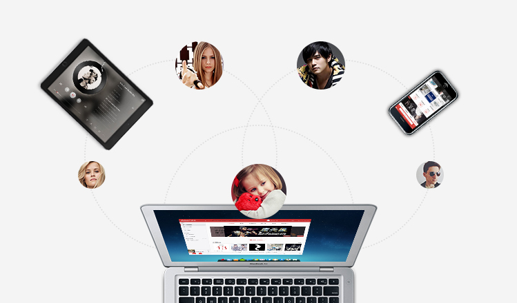
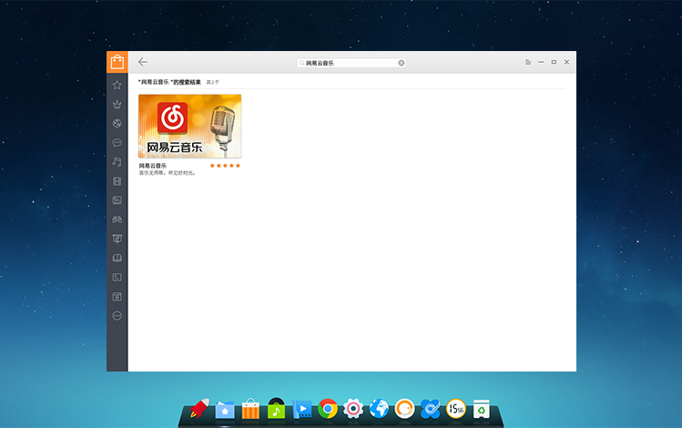

# 深度操作系统简介 {#deepin-intro}

摘自：[深度商业官网](https://www.deepin.com/)、[深度社区官网](https://www.deepin.org/)

## 深度科技简介

武汉深之度科技有限公司（简称：深度科技）成立于2011年，是专注基于Linux的国产操作系统研发与服务的商业公司。

作为国内顶尖的操作系统研发团队，深度科技以提供安全可靠、美观易用的国产操作系统与开源解决方案为目标，拥有操作系统研发、行业定制、国际化、迁移和适配、交互设计、支持服务与培训等多方面专业人才，能够满足不同用户和应用场景对操作系统产品的广泛需求。

深度科技作为国产操作系统生态的打造者，不但与各芯片、整机、中间件、数据库等厂商结成了紧密合作关系，还与360、金山、网易、搜狗等企业联合开发了多款符合中国用户需求的应用软件。深度科技的操作系统产品，已通过了公安部安全操作系统认证、工信部国产操作系统适配认证、入围国管局中央集中采购名录，并在国内党政军、金融、运营商、教育等客户中得到了广泛应用。

截止到2016年，深度操作系统下载超过5000万次，提供32种不同的语言版本，以及遍布六大洲28个国家84个镜像站点的升级服务。在全球开源操作系统排行榜上，深度操作系统已跃居前十名，也是排名最高的中国操作系统产品。
未来，深度科技将继续秉承开源和创新精神，以操作系统的自主可控替代为契机，争取在三年内成为中国市场主要操作系统供应商，五年后成为具备国际影响力的主流操作系统厂商。

## 深度桌面使用

各种小操作介绍，比如多桌面，连接无线网，等等

## 搜狗输入法

我个人觉得有必要介绍一下这个软件。当然我最希望有讯飞语音输入法，这个如果可以在 Linux 桌面下生存，是最好不过的。我就喜欢用这个语音输入法。

## QQ

国人挚爱。

## 深度截图

深度截图是深度科技团队开发的一款精巧截图应用，它具有智能窗口识别、快捷键支持、图片编辑、延迟截图、智能保存、调节图像分辨率等功能。
深度截图V4.0作为系统预装的截图工具，继承沿用了之前版本的大部分功能，对代码进行了重构和优化，截图打开速度真正做到秒开。全新设计了截图工具栏和选取框，新增直接截取右键菜单界面等功能。

**重构优化，速度秒开**

采用C++重构代码，提升打开截图启动速度，优化性能和交互体验，从此告别打开慢、截图卡死的现象，真正做到秒开。

**统一选框，白色主题**

优化选取框控件，统一系统界面交互和显示；默认将工具栏变换成白色主题，操作更加清晰明了。

**右键截取，一键即达**

除了全屏截图、窗口截图、延时截图之外，本次新增右键菜单界面直接截图。无需设置延时后操作等待截取，只需一键便可截取右键菜单界面。

**化繁为简，效率为王**

打开深度截图后，按下F1键直接调用帮助手册，简化旧版本调用帮助的交互。专注截图操作，取消分享功能，提高效率和避免出现问题。

**轻松下载，简单更新**

大家可以通过更新系统以获取深度截图V4.0，或者直接在深度商店搜索下载。

## 网易云音乐

为了带来更好的音乐体验，实现对音乐高品质的追求，经过网易云音乐与深度科技团队长达半年多的联合开发，大家期待已久的网易云音乐正式登陆Linux平台！

网易云音乐是一款专注于发现与分享的音乐产品，依托专业音乐人、DJ、好友推荐及社交功能，为用户打造全新的音乐生活。

**时尚界面 传承最新设计**

完美继承了Windows版本的最新界面风格和功能，不同的平台，同样的用户体验。

**千万曲库 首首超高品质**

网易云音乐拥有广袤的曲库，囊括千万首320Kbps超品质音乐，让你随时沉醉在美妙的音乐层次中。

**明星入驻 亲自推荐音乐**

过千名大牌明星、专业音乐人、DJ进驻，专业的私房“歌单”和音乐推荐，格调顿现。

**轻松社交 引发内心共鸣**

你可以关注明星、DJ和好友，浏览他们的动态、收藏和分享；还可以通过其他人的评论体会歌曲中的故事和感受。

**平台互通 歌单实时同步**

用户只需一个帐号，无论在哪个版本上收藏歌曲或创建歌单，只要连上网络，便可立即同步自己的数据信息，随时随地畅享好音乐。

**个性推荐 打造私人定制**

网易云音乐采用独一无二的算法，轻易邂逅那些你未听过又很喜欢的歌。【个性化推荐】和【私人FM】，比你更了解你。同时也是首个以“歌单”为核心架构的音乐产品，一步轻松创建“歌单”，音乐分享又容易又有趣。

**轻松获取 开启音乐之旅**

深度操作系统用户可运行深度商店，搜索“网易云音乐 ”进行安装体验，非深度操作系统用户可前往网易云音乐官网下载Linux客户端安装体验。

深度操作系统是一个致力于为全球用户提供美观易用、安全可靠的Linux发行版。建立完善的生态系统，打造更多的原生应用，给用户更好的体验，一直都是我们前进的方向。此次和网易云音乐合作，给Linux平台下的用户也带来高品质的在线音乐享受，而后续我们将不断努力开拓更多更好的应用。

## 深度系统监视器

## 深度无线投屏

## 使用人群

### 程序猿（媛）

### 文员

### 游戏爱好者
