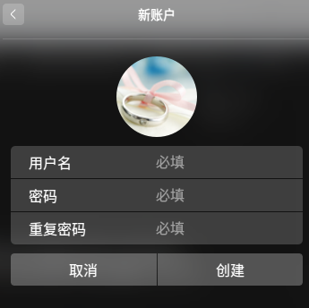

# 管理账户 {#chap:manager-user}

## 引言

本章会涉及到

+ 账户(user account)管理
+ 账户组管理
+ 其他方式的账户管理

深度操作系统安装过程中，会引导你设置一个普通账户，非根账户，也就是没有最高权限的普通账户。当有家人、朋友或者同事要使用我们的电脑的时候，可能要涉及到账户的添加和权限管理。这就是本章要讨论的内容。为了更方便的管理多个具有相同权限的账户，还会涉及到账户组的设置等。接下来会讲到怎么使用 `useradd`,`usermod` 等命令，配置自家目录、默认的 shell、分组、以及账户和组编号等。

用户是能够获取系统资源的权限的集合,账号包括用户名和密码,用户通过账号登陆系统.但是LINUX系统并不是通过用户名称来识别用户,而是通过UID(User Identification),即用户标识符. 并且LINUX的用户分为三类:

- **超级管理员** 0 ## root用户，具有操作整个系统的所用权限,默认禁止该账户直接登录
- **系统用户** 1~499 ## 能够登录系统获得有限权限的用户,并且可以使用sudo获取root权限 默认系统用户为普通用户
- **普通用户** 500~65535 ## 目前支持到4294967295，前两类用户建立的用户,只能执行普通操作

## 创建账户

为了更好的分配资源权限，保护信息安全，为某些使用者创建新的账户还是很有必要的。下面介绍，在深度操作系统下，两种创建账户的方式：图像方式（GUI），命令方式（Shell）。

### 图形方式

如下图所示，创建账户是非常简单的，打开设置侧栏，找到账户相关的那一部分，点击创建账户，进入到下图，填上用户名和密码等需要的数据，就可以了。




如果需要更改头像、设置全名、更改密码、设置是否自动登录免密码登录，可以选中需要修改的账户，点击进去就可以啦。


图形方式默认创建的账户是普通账户，比如是 `phptester` 账户，在 */etc/passwd*,*/etc/group* 会出现 `phptester` 相关的信息。有兴趣的读者，可以先去看看上述俩文件，后面还会对这俩文件作进一步的讲解。

### 命令方式

命令行工具，作为一个“全能”的存在，肯定是提供账户管理这方面的操作的。
下面介绍用户的查改增删操作。

#### 查看账户信息

Linux没有直接查看用户列表的命令，一般采用查看 */etc/passwd* 文件的方法查看账户信息。关于 */etc/passwd* 文件，在第\@ref()节已经介绍，这里不再重复。

```bash
$ vim /etc/passwd
```

#### 增加账户

使用命令 `useradd` 可以添加账户。

#### 修改账户

修改账户的密码，使用`passwd`命令。修改账户的用户名、主目录、用户组等，使用`usermod`命令。

#### 删除账户

删除账户，使用`userdel`命令。

```bash
$ sudo userdel tester    #删除tester用户在passwd、shadow、group文件中的相关条目,不删除tester的家目录
$ sudo userdel -r tester #删除tester用户在passwd、shadow、group文件中的相关条目并且删除tester的家目录
```
